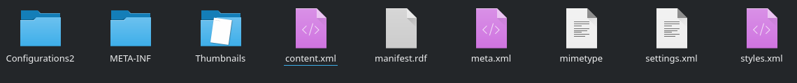
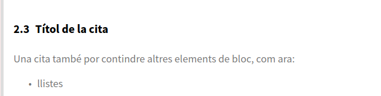

---
# Informació general del document
title: 1. El llenguatge Markdown
lang: ca
page-background: img/bg.png

# Portada
titlepage: true
titlepage-rule-height: 2
titlepage-rule-color: AA0000
titlepage-text-color: AA0000
titlepage-background: img/portada.png

# Taula de continguts
toc: true
toc-own-page: true
toc-title: Continguts

# Capçaleres i peus
header-left: 1. El llenguatge Markdown
header-right: Curs 2021-2022
footer-left: CEFIRE València
footer-right: \thepage/\pageref{LastPage}

# Imatges
float-placement-figure: H
caption-justification: centering

# Llistats de codi
listings-no-page-break: false
listings-disable-line-numbers: false

header-includes:
   - \usepackage{lastpage}
---

# Introducció: L'art d'escriure davant un ordinador {#introduccio}

Quan ens enfrontem a la tasca de crear un document o uns apunts, i una vegada superada la síndrome del *full en blanc*, solen aparéixer nous interrogants i dubtes mentre els elaborem referents a l'aspecte final del document... numeració d'epígrafs, format dels títols, taules, portada, etc. Açò fa que sovint, dediquem gran part del temps a la formatació en detriment del contingut.

Per altra banda, quan treballem amb diferents processadors de text, i tot i que cada vegada són menys, poden aparéixen problemes de compatibilitat o de presentació entre els formats que aquests utilitzen. Més encara, quan intentem utilitzar plantilles preformatades amb un processador concret en un altre.

Els processadors de text actuals, tipus LibreOffice o MS Office, segueixen un paradigma per a la creació de documents anomenat **WYSIWYG** (*What You See Is What You Get*, *el que veus és el que tens*). Aquest paradigma s'aplica tant a processadors de text com a altres tipus d'editors, com puguen ser alguns editors web, i es basa en la possibilitat de poder escriure el document veient o treballant directament sobre el resultat final. El primer processador de text d'aquest tipus va ser *Bravo*, per a l'ordinador *Xerox Alto*, a la dècada dels 70.

Els processadors i editors basatas en aquest paradigma, tenen, com és evident, l'avantatge que podem anar escrivint el resultat final, ocultant la representació interna dels diferents elements. Per contra, aquest fet fa que es genere molta més informació de la necessària a l'hora de representar internament els documents, i aquests acaben ocupant molt més del que es necessitaria.

Un altre paradigma, tot i que menys conegut és el **WYSIWYM** (*What You See Is What You Mean*, *el que veus és el que vols dir*), segons el qual, l'usuari s'encarrega d'introduir els continguts de forma estructurada, segons el seu significat, en lloc d'indicar el format de representació final. La idea és indicar si el que s'està escrivint és un títol, una secció, el nom de l'autor, etc. en lloc d'indicar el seu format. El propi processador o altres eines externes, hauran de ser el qui generen el document en el seu format final, coherent amb el text i l'estructura especificades.

L'avantatge d'aquests sistemes és que es fa manifesta la separació entre contingut i presentació, de manera que només ens hem de preocupar de l'estructura i els continguts, deixant a banda els aspectes visuals per a que s'encarregue d'ells el propi sistema d'exportació.

**Markdown** es un llenguatge que segueix aquest paradigma, i ens servirà doncs per generar documents que ens permeten centrar-nos més en el contingut i no estar tan pendents de l'aspecte final.

## Processadors vs editors

Per tal d'acabar d'aclarir els conceptes vistos en l'anterior apartat, anem a il·lustrar la diferència entre un processador de textos (WYSIWYG) i un editor de textos (WYSIWYM). 

Per això, anem a creem un arxiu *Document.odt* en LibreOffice on simplement escriurem el text *Document creat amb LibreOffice* i veurem que realment es tracta d'una carpeta comprimida amb diferents documents al seu interior, els quals definieixen l'aspecte final que presenta el contingut. 


L'arxiu *Document.odt* el podem obrir amb la utilitat que normalment utilitzem per descomprimir arxius i veure que realment tenim els següents documents:



Com podeu deduir, el contingut del nostre arxiu estarà definit a l'arxiu *content.xml*, acompanyat d'una sèrie d'etiquetes XML. Ara podem obrir este arxiu amb un editor de textos tipus bloc de notes (Windows) o gedit/kate (Linux) per veure el seu format.

Quasi al final del document tenim definit el nostre contingut en una línia com la següent:

```xml
<text:p text:style-name="P1">Document creat amb LibreOffice</text:p>
```

La línia anterior indica que és un paràgraf de text amb l'estil P1 o estil de paràgraf per defecte.

Si ara repetim el procés però creant un arxiu *Document.txt* amb un editor de textos amb el contingut *Document creat amb editor de textos* i l'obrim amb un editor, veurem que simplement tenim guardat el text que haviem escrit, sense que el programa haja insertat informació adicional o creat arxius adicionals.

Com ja hem comentat, simplement guarda la informació en forma de text, sense formats. Açò fa que la compatibilitat entre sistemes siga total, a diferència dels formats de processadors de textos, on pot haver algunes incompatibilitats.

# El llenguatge Markdown

Markdown es defineix com un **llenguatge de marques lleuger**, amb la finalitat d'escriure utilitzant un format de text pla, fàcil d'escriure i de llegir, i que puga convertir-se a altres formats, com HTML, epub o pdf.

>
> **Lenguatges de marques**
>
> Un llenguatge de marques o llenguatge de marcat s'entén com una forma de codificació de documents, que junt amb el text, incorporten etiquetes o marques amb informació addicional sobre l'estructura del text o la presentació. Els llenguatges de marques més coneguts són l'HTML (*HyperText Markup Language*) i l'XML (*Extensible Markup Language*).
>
> Quan parlem d'un **llenguatge de marques lleuger**, fem referència a llenguatges de marques que utilitzen un format de text més o menys estandarditzat, que ocupa poc espai i que és fàcil de llegir i d'escriure.
>

El llenguatge Markdown va ser creat per John Gruber, amb la finalitat d'aconseguir la màxima legibilitat i facilitat de publicació, i es va inspirar en moltes convencions existents per al marcat de misstges de correu electrònic utilitzant text pla. Segon John Gruber *Un document amb format Markdown hauria de ser publicable tal qual, com a text pla, sense que semble que s’ha marcat amb etiquetes o instruccions de format.* 

Actualment, Markdown s'utilitza en molts àmbits, especialment en la generació de documentació i contingut web, en llocs com Github, o sistemes de gestió de continguts com Jekyll, Hugo, Gitbook, i fins i tot la plataforma Moodle. Per a la generació de documentació en pdf, existeixen eines, com *pandoc*, que veurem més endavant, i que fan ús del potent sistema de composició de textos *LaTeX* per a la seua formatació.

Amb Markdown podem formatar el text amb lletres cursives, negretes, capçaleres o enllaços utilitzant únicament text pla, el que fa que l'escriptura siga més simple i eficient, ja que ens evita haver d'estar pensant en el format i ens permet centrar-nos només en el contingut. 

## Variants

La versió original de Gruber podríem dir que és el format estàndard. Aporta format de text (negretes i cursives), així com marques de continguts (títols, imatges, enllaços, cites, línies horitzontals o blocs de codi), llistes ordenades i desordenades, etc.

A banda d'aquesta versió original, han anat apareixent diverses variants, entre les que podem destacar:

* **CommonMark**: Variant centrada en la conversió a HTML.
* **Github Flavored Markdown**: Markdown utilitzat a la plataforma d'allotjament de projectes Github, que afig sintaxi relacionada amb el contingut relatiu al control de versions, revisions, etc.
* **Multimarkdown**, Variant que afig altres funcionalitats i continguts,
* **Pandoc Markdown**: Variant basada en l'estàndard, però amb extensions que ens permeten afegir marques d'altres variants, i que incorpora diverses millores. Aquesta serà la versió que utilitzem quan utilitzem *Pandoc* per a la generació de documents.

> **"Fitxers de text"**
>
> Abans de continuar, i tot i que a molts de vosaltres vos semblarà evident, anem a puntualitzar el concepte de *fitxer de text*.
>
> Un document generat en qualsevol processador de text, tot i que el seu contingut aparent és text, és un tipus de fitxer més complex, on internament s'emmagatzema informació sobre la formatació, metainformació, etc. i generalment es comprimeix en un únic document, amb extensió com puga ser *odt* o *docx*. 
>
> Un *fitxer de text simple*, també conegut com text sense format o text pla (*plain text*), conté únicament text format per caràcters legibles per les persones, sense cap informació de representació interna. Únicament contenen els *bytes* que representen caràcters ordinaris com lletres, números, signes de puntuació, i caràcters de control com tabulacions, salts de línia i retorns de carro. 
>

>
> **Edició de documents amb Markdown**
>
> A partir d'aquest punt, anem a abordar la sintaxi del llenguatxe Markdown, on s'aniran mostrant exemples de la notació utilitzada i la seua interpretació.
>
> Seria convenient que anàreu provant els diferents exemples que es mostren, per tal que no es convertisca en una lectura tediosa i poc profitosa.
>
> En aquest punt, és doncs interessant fer una pausa en aquest document i donar una ullada al document sobre *Edició de fitxers amb Markdown*, on es presenten un parell d'eines per tal d'escriure amb aquest llenguatge, de manera que pugueu anar provant d'aci en avant els exemples.
>


## Sintaxi de Markdown

Com hem dit, Markdown es basa en fitxers de tipus text, que no contenen cap informació *interna* sobre el format. Aquesta informació, s'especificarà de forma explícita mitjançant etiquetes, que seran visibles en tot moment, i que facilitaran, per una banda la seua interpretació a l'hora d'exportar-los a altre format, però també la seua lectura per part de les persones.

En aquet apartat, el central del tema, anem a veure quins són els diferents elements que podem utilitzar en un text en format Markdown, així com les principals marques de format.

### Paràgrafs

Un paràgraf, tal i com l'entén Markdown, és un bloc de text definit entre **dos salts de línia** (tecla `Intro/Enter/Entrar`). 

Si utilitzem només un salt de línia, es sobreentén que és el mateix paràgraf, i a l'hora de generar el document, el veurem com a tal.

Si el que desitgem, per altra banda és afegir només un salt de línia a la meitat d'un paràgraf, afegirem almenys dos espais al final de la línia, i un sí que utilitzrem un (només un) salt de línia.

Veiem-ho amb algun exemple:

```markdown
Aquest és el primer paràgraf, com veieu, necessita dos salts de línia, o el que sería el mateix, una línia en blanc després del paràgraf.

Aquest és un altre paràgrar,   
en el que hem forçat salts de línia,    
i encara que no es veja, aquestes línies  
acaben amb dos o més espais en blanc.
```    

### Capçaleres

Hi ha diverses formes de marcar capçaleres:

* Utilitzant al menys un símbol `=`o `-` després del text per indicar capçaleres de primer i segon nivell:

```markdown
Açò sería una capçalera de primer nivell
========================================

Açò sería una capçalera de segon nivell
---------------------------------------

Recordeu que només cal un = o un -, encara que se'n poden utilitzar més, com és el cas d'aquest exemple, on s'han utilitzat tants símbols com longitud té el títol.
```

* Utilitzant l'**Estil ATX**, al qual, utilitzem el símbol `#` abans del text per indicar el nivell de la capçalera. S'admeten fins a sis nivells de profunditat (`######`), el que vindria a ser del `h1` fins al `h6` d'HTML.

```markdown

# Capçalera de primer nivell

## Capçalera de segon nivell nivell

### Capçalera de tercer nivell nivell

...

###### Capçalera de nivell 6
```

>
> **A tenir amb compte**
>
> La versió estàndard de Markdown no requereix d'una línia en blanc abans d'una capçalera, però d'altres versions, com per exemple la de *Pandoc* sí que la requereix. No obstant això, encara que l'estàndard no ho utilitze, convé afegir-la ja que facilita així la lectura i localització d'aquestes.
>
> Algunes implementacions, tampoc requereixen d'un espai entre el símbol `#` inicial i el primer caràcter del títol. *Pandoc* sí que demana aquest espai, de manera que podem posar un `#hastah` al principi d'un paràgraf sense que l'interprete com una capçalera.
>

### Atributs a la capçalera

Quan es genera un document, ja siga PDF, HTML o altre format a partir d'un document en Markdown, a les capçaleres se'ls assigna un identificador de manera automàtica, per a que es puga fer referència a elles des d'altres parts del document. Aquest identificador s'obté a partir del text de la capçalera, pel que si aquesta és llarga, l'identificador també ho serà. La versió de Pandoc, ens permet afegir certs atributs a les capçaleres, entre les que es troba l'identificador. 

Veiem-ho amb un exemple. Donada, per exemple la primera capçalera d'aquest document:

```markdown
# Introducció: L'art d'escriure davant un ordinador
```

L'identificador que es genera és: `id="introducció-lart-descriure-davant-un-ordinador"`. 

Aquesta capçalera, la podriem haver escrit també de la següent forma:

```markdown
# Introducció: L'art d'escriure davant un ordinador { #introduccio }
```

Sent l'identificador de la capçalera només `#introduccio`, de manera que podem fer referència a l'apartat mitjançant aquest.

Disposeu de més informació sobre les capçaaleres a la [secció de Markdown manual del manual de Pandoc](https://pandoc.org/MANUAL.html#headings).

### Formatació de text

Markdown ens permet fer ús del símbol de l'asterisc com a marca de format per tal d'indicar textos tant en cursiva, com en negreta o ambdós. Per a això farem ús d'ún, dos o tres asteriscs al principi i al final del text que volem remarcar. A més, cal tindre en compte que no hem d'afegir cap espai entre els asteriscs del principi i la primera paraula i els asteriscs del final i la última.

Veiem-ho amb exemples:

```markdown
Amb un asterisc marquem un *text en cursiva*
Amb dos asteriscs marquem un **text en negreta** 
Amb tres asteriscs marqiem un ***text en cursiva i negreta***

En canvi, si afegim algun espai entre mig, ** no s'interpretarà correctament**
```

Resultat:

Amb un asterisc marquem un *text en cursiva*  
Amb dos asteriscs marquem un **text en negreta**   
Amb tres asteriscs marqiem un ***text en cursiva i negreta***

En canvi, si afegim algun espai entre mig, ** no s'interpretarà correctament**


### Línies horitzontals

Una línia horitzontal es defineix mitjançant tres o més símbols `*`, `-` o `_`, separats o no per espais:

```markdown
- - -

* * *

_ _ _
```

Resultat:

- - -

* * *

_ _ _


### Llistes

Markdown permet fer ús tant de llistes ordenades com llistes no ordenades.

#### Llistes no ordenades

Les llistes no ordenades es marquen fent ús dels símbols `*`, `+` o `-` al principi de cada element, i incloent cada ítem en una línia diferent (i no fan falta dos salts de línia).

```markdown
* Element 1
* Element 2
...
```

Cada element de la llista pot contindre diversos paràgrafs, i altres continguts a nivell de bloc. Quan volem incloure diversos paràgrafs a un ítem de la llista, el segon paràgraf i posteriora hauran d'anar **precedits per una línia en blanc, i sagnats per aliniar-se amb el contingut que no siga l'espai després del marcador de la llista**.

Per exemple:

```
* Primer element de la llista
* Segon element de la llista

  Altre paràgraf corresponent al segon element de la llista.
  No cal un espai en blanc entre l'últim paràgraf i el següent element,
  però el podem afegir per facilitar la lectura de la llista.

* Tercer element de la llista.
```

Una llista pot contindre dins altres llistes. En aquest cas, podem o no incloure una línia en blanc al davant. Per utilitzar una llista dins d'una altra només haurem de *sagnar* la llista que està dins l'altra per aliniar-la amb el primer caràcter de text de l'element que la conté. Podem tindre tantes llistes dins d'altres com volguem.

```markdown
* Element 1
  * subelement 1.1
    * subelement 1.1.1
    * subelement 1.1.2
  * subelement 1.2
  * subelement 1.3
* Element 2
```

En aquests casos, com que podem utilitzar diversos símbols per indicar llistes, se sol utilitzar un element per cada nivell de la llista, amb la finalitat de facilitar la lectura del text pla:

```markdown
* Element 1
  + subelement 1.1
    - subelement 1.1.1
    - subelement 1.1.2
  + subelement 1.2
  + subelement 1.3
* Element 2
```

Resultat:

* Element 1
  + subelement 1.1
    - subelement 1.1.1
    - subelement 1.1.2
  + subelement 1.2
  + subelement 1.3
* Element 2

#### Llistes ordenades

El funcionament de les llistes ordenades és el mateix que les no ordenades, llevat que cada element de la llista porta un número en lloc d'una *vinyeta*.

En la versió estàndard de Markdown els elements que indiquen l'ordre han de ser **números decimals seguits d'un punt i un espai**. En l'estàndard, **aquests números s'ignoren**, pel que la llista:

```markdown
1. Element 1
2. Element 2
3. Element 3
```

Serà la mateixa que:

```markdown
4. Element 1
5. Element 2
6. Element 3
```

El Markdown de Pandoc, afig un parell d'extensions a aquesta forma d'utilitzar les llistes ordenades.

En primer lloc, a més de números, permet marcar els elements d'una llista ordenada amb lletres majúscules, minúscules o números romans. Per a això utilitzarem com a marcadors de llista la lletra entre parèntesi o bé només amb el parèntesi dret, seguit d'almenys un espai. També podem utilitzar el punt, però en aquest cas, afegint dos espais com a mínim rere el punt en lloc d'un.

Per exemple:

```markdown
(A) Element 1
(B) Element 2

A) Element 1
B) Element 2

I.  Element 1, amb dos espais mínims després del punt
II.  Element 2, amb dos espais mínims després del punt
```

Per altra banda, amb Pandoc també podemutilitzar el símbol `#` com a marcador de llista ordenada, de manera que el sistema pose automàticament la numeració. Així el codi:

```markdonw
#. element 1
#. element 2
```

Generaría la llista:

```markdown
1. element 1
2. element 2
```

Una altra extensió del Markdown de Pandoc respecte al Markdown original és que conserva la numeració a partir del número inicial. Per exemple, si indiquem per error:

```markdown
5. Element 5
7. Element 6
8. Element 7
```

L'eixida serà la següent, on es corregeix aquest error en la numeració.

```markdown
5. Element 5
6. Element 6
7. Element 7
```

#### Llistes de tasques

Una extensió més que afig la versió de Pandoc a l'estàndard és la possibilitat d'utilitzar llistes de tasques, introduïdes al Markdown de Github.

Per utilitzar aquest tipus de llistes utilitzem el guió com a marcador de llista seguit d'un espai i les seqüències de caràcters `[ ]`i `[x]` per indicar un element de llista no marcat i marcat respectivament. Per exemple:


```markdown
- [ ] Element de llista com a tasca sense marcar
- [x] Element de llista com a tasca marcada.
```

Obtindría com a resultat:

- [ ] Element de llista com a tasca sense marcar
- [x] Element de llista com a tasca marcada.

### Taules

Les taules ens serveixen per tal de presentar informació de manera organitzada.

La versió original de Markdown de John Gruber no inclou la definició de taules en la sintaxi de Markdown. Com que inicialment es va concebir com una eina per fer la conversió a HTML, per afegir taules s'utilitzava directament aquest llenguatge.

No obstant això, les diferents variants de Markdown han anat afegint notacions i extensions al Markdown original per suportar taules.

La sintaxi per crear taules del Markdown de Github és una de les més esteses, i fa ús de barres verticals (`|`) i guions (`-`) per crear les taules. Els guions s'utilitzen per creat l'encapçalament de cada columna, i les barres verticals serveixen de separador de cada columna. A més, per a que la taula es represente correctament, cal una línia en blanc abans de la taula.

Les taules, en aquest format han de tindre necessàriament una capçalera i un cos, i seguiran la següent sintaxi:

```markdown
| Capçalera 1 | Capçalera 2 |
|-------------|-------------|
| Valor 1     | Valor 2     |
| Valor 3     | Valor 4     |
```
Que té com a resultat:

 Capçalera 1 | Capçalera 2 
-------------|-------------
 Valor 1     | Valor 2     
 Valor 3     | Valor 4    

  

Algunes consideracions:

* Podem afegir tants camps (columnes) com volguem. 
* La línia que separa la capçalera del cos `|---|---|` és obligatòria, però no és necessari que tinga tants caràcters com tinguen les capçaleres, pel que no cal que la taula estiga completament aliniada. 
* Les barres verticals (`|`) del principi i del final són opcionals.

#### Formatat el contingut d'una taula

Dins una taula podem utilitzar també certes marques de format, com negretes, cursives, enllaços, imatges...

A més, podem aliniar el text a l'esquerra, a la dreta o al centre de la columna, afegint la marca dos punts `:`, al costat esquerra, dret, o als dos, dels guions de l'encapçalament.

Veiem-ho amb un exemple. La següent definició de taula:

```markdown
| Text a l'esquerra | Text centrat | Text a la dreta |
|        :---       |     :---:    |      ---:       |
| xxx               | xxx          | xxx             |
| xxxxx             | xxxxx        | xxxxx           |
```

Té el següent resultat:

| Text a l'esquerra | Text centrat | Text a la dreta |
|        :---       |     :---:    |      ---:       |
| xxx               | xxx          | xxx             |
| xxxxx             | xxxxx        | xxxxx           |

>
> Si el que volem és afegit dins una taula una barra vertical com a contingut, hem de posar abans el símbol `\`, per indicar que el caràcter següent no s'ha d'interpretar com a marca de format Markdown. Aquesta barra invertida s'anomena caràcter d'*escapament*, i a la combinació d'ella amb qualsevol marca que volguem que no s'interprete es coneix com *seqüència d'escapament*.
>

#### Peculiaritats de les taules en Pandoc Markdown

Pandoc, a més de l'anterior, inclou tres formes més de crear taules: taules simples, taules multilínia i taules de quadrícula. Per a aquests tipus de taules, convé treballar amb un tipus de lletra a l'editor d'amplada fixa, ja que requereixen que les columnes estiguen aliniades, i amb tipus de lletra de longitud variable ens resultarà complicat fer aquest aliniament.

* **Taules simples**: Utilitzen només el guió (`-`) per indicar la separació de la capçalera de la taula. S'utilitzarà una línia discontínua formada per guions, on cada separació d'espais determinarà una columna. Aquestes taules estan subjectes a les següents regles:

* Les files de capçalera i de contingut han de cabre en una mateixa línia, i els aliniaments de cada columna es determinen per la posició del text de la capçalera en relació amb la línia discontínua formada pels guions.
* Per aliniar el text de la capçalera i el contingut a l'esquerra, s'alinia el començament del text de la capçalera amb l'inici de la marca de cada columna amb la línia discontínua.
* Per aliniar el text de la capçalera i el contingut a la dreta, s'alinia el final del text de la capçalera amb el final de la marca de cada columna amb la línia discontínua.
* Si la capçalera no s'alinia ni al principi ni al final amb la marca de la columna, el text serà centrat.
* Si s'alinia el text de la capçalera de la columna als dos costats (la línia té la mateixa longitud que la capçalera), s'utilitza l'aliniació per omissió (generalment a l'esquerra).
* La taula ha d'acabar amb una línia en blanc (dos salts de línia), o bé una línia de guions seguida d'una línia en blanc.
* Si no volem utilitzar capçalera, podem definir la taula entre les línies de guions. En aquest cas, els aliniaments venen determinats per la primera fila de dades.

Veiem algunas exemples:

***Exemple 1. Aliniació***. Fixeu-vos que l'aliniació la determina la capçalera, no el text de cada columna.

La taula:

```markdown
  Dreta     Esquerra       Centrat    Per defecte
-------     ----------   ----------   -----------
12          12           12           12
123         123          123          123
1           1            1            1
```

Es transforma en:

  Dreta     Esquerra       Centrat    Per defecte
-------     ----------   ----------   -----------
12          12           12           12
123         123          123          123
1           1            1            1

***Exemple 2. Taula sense capçalera***. Fixeu-vos que en aquest cas, l'aliniació vé defnida per la primera fila de dades.

La definició:

```markdown
------- ------ ---------- --
     12 12        12      12
123     123    123        123
4567    4567   4567       4567
------- ------ ---------- --
```

Genera la taula:

------- ------ ---------- --
     12 12        12      12
123     123    123        123
4567    4567   4567       4567
------- ------ ---------- --

* **Taules multilínia**: Es tracta de taules que permeten separar el contingut d'una fila en vàries línies, per tal de fer el contingut més legible en el fitxer en Markdown, però que es transformen en una sola línia a l'hora de presentar-les.


Veiem un exemple. La següent definició:

```markdown
---------------------------------------------------
Aliniació     Capçalera         Aliniació Aliniació
a l'esquerra  centrada         a la dreta per defecte
------------ ------------ --------------- ---------
  Fila1        Fila 1      Fila 1          Fila 1
  Columna1     Columna2    Columna 3       Columna 3
  
  Fila2        Fila 2      Fila 2          Fila 2
  Columna1     Columna2    Columna 3       Columna 3
----------------------------------------------------
```

Generarà la següent taula:

---------------------------------------------------
Aliniació     Capçalera         Aliniació Aliniació
a l'esquerra  centrada         a la dreta per defecte
------------ ------------ --------------- ---------
  Fila1        Fila 1      Fila 1          Fila 1
  Columna1     Columna2    Columna 3       Columna 3
  
  Fila2        Fila 2      Fila 2          Fila 2
  Columna1     Columna2    Columna 3       Columna 3

----------------------------------------------------

El funcionament és semblant a les taules simples, però amb algunes peculiaritats:

* Les taules comencen amb una fila de guions abans del text de la capçalera. Aquesta línia es pot ometre si no es va a utilitzar capçalera.
* Les taules acaben amb una fila de guions i una línia en blanc
* Les diferents files se separen per línies en blanc.


Quan es genera la taula, es tindrà en compte l'amplada espeficicada de les columnes, pel que si l'eixida queda estreta, podem allargar la línia de guions que defineix l'amplada de la columna. 

Cal recordar també que a l'igual que en les tuales simples, es pot ometre la capçalera.

* **Taules en forma de quadrícula o graella**: Aquestes taules ens permeten definir de forma més *gràfica* la taula.

Els aspectes més destacats d'aquest tipus de taules són:

* Utilitzen el símbol `|` com a separador de columnes,
* Utilitzen el guió `-` per separar files, llevat de la de capçalera, que utilitza el signe d'igual (`=`).
* Utilitza el símbol `+` com a separador de columnes en les línies amb guions i iguals.
* Dins de cada *cel·la* podem especificar qualsevol tipus de contingut.

Ho veurem més clar amb un exemple. Si definim la següent taula:

```markdown
+---------------+----------------+-------------+
| Capçalera 1   | Capçalera 2    | Capçalera 3 |
+===============+================+=============+
| Contingut 1   |  - element 1   |             | 
|               |  - element 2   |             |
|               |  - element 3   |             |
+---------------+----------------+-------------+
| Contingut 2   |                | #. item 1   |
|               |                | #. item 2   | 
+---------------+----------------+-------------+
```

Obtindrem:

+---------------+----------------+-------------+
| Capçalera 1   | Capçalera 2    | Capçalera 3 |
+===============+================+=============+
| Contingut 1   |  - element 1   |             | 
|               |  - element 2   |             |
|               |  - element 3   |             |
+---------------+----------------+-------------+
| Contingut 2   |                | #. item 1   |
|               |                | #. item 2   | 
+---------------+----------------+-------------+


**Títols per a les taules**: Pandoc permet també afegir un títol a una taula. Un títol no serà més que un paràgraf que comence amb la cadena `Table:`, i simplificant, fent ús dels dos punts `:`, a continuació de la taula. 

Veiem-ho amb un exemple:

```markdown
| Capçalera 1 | Capçalera 2 | 
|-------------|-------------|
| Item 1      | Item 2      |
Table: Aquest és el títol de la taula
```
Que generarà:

| Capçalera 1 | Capçalera 2 | 
|-------------|-------------|
| Item 1      | Item 2      |
Table: Aquest és el títol de la taula

### Fragments de codi

Markdown té un ampli ús en la documentació tècnica de projectes informàtics, on és habitual incloure fragments del codi font dels programes. Per tal de ressaltar aquests tipus de fragments, Markdown utilitza una sintaxi especial, fent ús dels caràcters de l'accent obert: \`.

Quan es tracta de fragments de codi que han d'anar en la mateixa línia que el text, per exemple si volem indicar una etiqueta HTML, ho fem, \`d'aquesta manera\`, fent ús d'un únic caràcter d'accent, mentre que si el que volem és escriure un bloc de codi, utilitzaríem tres símbols d'accent obert \`\`\`. A més, rere els primers símbols, podem especificar de quin llenguatge es tracta. Per exemple, per indicar el codi HTML d'una pàgina web, faríem:

    ```html
      <html>
          <body>
            <h1>Títol de la pàgina web</h1>
            <p>Paràgraf</p>
          </body>
        </html>
    ```
Que ens generaría:
```html
   <html>
       <body>
         <h1>Títol de la pàgina web</h1>
         <p>Paràgraf</p>
       </body>
     </html>
```

Cal remarcar que el nom del llenguatge rere les cometes fa que al mostrar el resultat, es tinga en compte el llenguatge de programació per tal de ressaltar-ne la sintaxi pròpia del llenguatge.

### Cites

En Markdown un bloc de text en forma de cita consisteix en un o més paràgrafs o altres elements de bloc (com per exemple llistes o capçaleres), on cada línia es troba precedira del caràcter `>` i opcionalment un espai.

Veiem alguns exemples:

**Exemple 1**:

```markdown
>
> *Un document amb format Markdown hauria de ser publicable tal qual, com a text pla, sense que semble que s'ha marcat amb etiquetes o instruccions de format.*
>
> John Gruber
```

Genera el següent:

>
> *Un document amb format Markdown hauria de ser publicable tal qual, com a text pla, sense que semble que s’ha marcat amb etiquetes o instruccions de format.*
>
> John Gruber


**Exemple 2**

```markdown
>
> # Títol de la cita
>
> Una cita també por contindre altres elements de bloc, com ara:
>
> - llistes
> - capçaleres
> - imatges
```

Genera:



A més, podem afegir cites dins d'altres. Amb:

```markdown
>
> Paràgraf de la cita.
>
> > Cita dins la cita
>
```

Generem el següent:

>
> Paràgraf de la cita.
>
> > Cita dins la cita
>

Per altra banda, podem especificar les cites de forma *mandrosa*, afeging només el caràcter `>` en la primera línia de cada bloc:

```markdown
> Aquesta és una cita, dins un
paràgragraf de dos línies.
```

Tot i ser possible, aquesta opció no és massa recomanada perquè lleva legibilitat al text en cru. 

### Enllaços

Markdown ens permet generar enllaços tant a adreces d'Internet, com fer referència a fitxers locals, mitjançant la seua ruta relativa o fins i tot dins el propi doument.

El format general per afegir un enllaç és el següent:

```
[Text de l'enllaç](URL_o_adreça_relativa)
```

Per exemple, per afegir un enllaç a un lloc web, escriurem:

```
Aci afegim un [enllaç a la web del cefire](http://cefire.edu.gva.es/)
```

Que genera:

Aci afegim un [enllaç a la web del cefire](http://cefire.edu.gva.es/)

Per tal d'afegir un enllaç a una seccíó del nostre document, farem ús de l'identificador que s'assigna automàticament, o bé que li hem assignat nosaltres. Per exemple, si per a l'apartat introductori vam afegir un identificador de la següent forma:

```markdown
# Introducció: L'art d'escriure davant un ordinador {#introduccio}
```

Podem fer referència a ell de la manera següent:

```markdown
Feu click [al següent enllaç](#introduccio) per tornar a la secció d'Introducció.
```
Que generaría:

Feu click [al següent enllaç](#introduccio) per tornar a la secció d'Introducció.


### Imatges

La sintaxi per afegir una imatge és semblant a la de l'enllaç, predecida d'una exclamació `!`:

```

```

A l'igual que els enllaços, la ubicació pot ser una adreça d'Internet o bé la ruta a un fitxer local al nostre ordinador:

```


```

En aquest segon cas, busca la imatge *logoMarkdown.png* en una carpeta *imatges* ubicada a la mateixa carpeta on es troba el nostre arxiu de text Markdown.

Cal tindre en compte que quan s'exporte el fitxer a HTML, aquestes referències seguiran existint al codi HTML, pel que caldrà incloure-les en qualsevol distribució del document HTML que fem. Per altra banda, quan fem una exportació a PDF, la imatge ja s'inclourà dins el propi document.

#### Afegint tamany a les imatges

La versió de Pandoc de Markdown a més permet afegir certs atributs a les imatges. Entre aquests  destaquen especialment `width` i `height`, que permeten especificar la grandària de la imatge. 

Si no s'indica res, el tamany s'entén que s'especifica en píxels, però podem utilitzar altres unitats com *px, cm, mm, in, inch i %*, sense incloure espais entre el número i les unitat. 

Veiem alguns exemples:

```markdown
{ width=2cm }

{ width=50mm }

{ width=3inch }

{ width=50% }
```

Que generen el següent:

{ width=2cm }

{ width=50mm }

{ width=3inch }

{ width=50% }

### Fòrmules matemàtiques

Qualsevol text que introduim entre els caràcters del dòlar (`$`) es tractarà com a una expressió matemàtica. Tot i que alguns sistemes s'accepta posar un espai entre els símbols del dòlar i l'expressió matemàtica, per fer-ho compatible amb el Markdown de Pandoc, no huarem de posar cap espai en blanc. 

Per exemple:

```markdown
*Fòrmula d'Euler* dins en una línia d'un paràgraf: $e^{i\pi} + 1 = 0$
```

Genera:

*Fòrmula d'Euler* dins en una línia d'un paràgraf: $e^{i\pi} + 1 = 0$

Si volem que la fòrmula ocupe tot un bloc en lloc d'afegir-la dins una línea, farem ús de dos dòlars en lloc d'un (`$$`):

```markdown
$$e^{i\pi} + 1 = 0$$
```

Que generarà el bloc:

$$e^{i\pi} + 1 = 0$$

Quan treballem amb fòrmules matemàtiques, podem utilitzar els següents elements:

* **Lletres de l'alfabet grec**:

| Simbol | Representació |
|:-------:|:--------------:|
| `$\alpha$` | $\alpha$ |
| `$A$` |  $A$ |
| `$\beta$`  |  $\beta$ |
| `$B$`  | $B$ |
| `$\gamma$` |  $\gamma$ |
| `$\Gamma$` |  $\Gamma$ |
| `$\pi$` |  $\pi$ |
| `$\Pi$` |  $\Pi$ |
| `$\phi$` |  $\phi$ |
| `$\Phi$` |  $\Phi$  |
| `$\varphi$` |  $\varphi$ |
| `$\theta$` | $\theta$ |

* **Funcions i operadors**:

| Simbol | Representació |
|:-------:|:--------------:|
| `$\cos$` | $\cos$ |
| `$\sin$ `| $\sin$ |
| `$\lim$` | $\lim$ |
| `$\exp$` | $\exp$  |
| `$\to$` |  $\to$  |
| `$\infty$` |  $\infty$ |
| `$\equiv$` | $\equiv$ |
| `$\times$` | $\times$ |


* **Exponents i subíndex**

| Simbol | Representació |
|:-------:|:--------------:|
| `$k_{n+1}$` | $k_{n+1}$  |
| `$n^2$` | $n^2$ |
| `$k_n^2$` | $k_n^2$ |

* **Fraccions i binomis**

$$\frac{n!}{k!(n-k)!}$$

| Simbol | Representació |
|:-------:|:--------------:|
| `$$\frac{n!}{k!(n-k)!}$$` | $$\frac{n!}{k!(n-k)!}$$ |
| `$\binom{n}{k}$` | $\binom{n}{k}$ |
| `$\frac{\frac{x}{1}}{x - y}$` | $\frac{\frac{x}{1}}{x - y}$  |
| `$^3/_7$` | $^3/_7$ |


* **Arrels**

| Simbol | Representació |
|:-------:|:--------------:|
| `$\sqrt{k}$` | $\sqrt{k}$ |
| `$\sqrt[n]{k}$` | $\sqrt[n]{k}$ |

Caldrà tindre en compte que alguns d'aquests símbols, sobre tot els més complexos, com ara les arrels o fraccions és possible que no tinguen la mateixa representació segons el format d'eixida i el motor amb què ho convertim. Ho tractarem més endavant.

> **Més informació!**
>
> Existeixen molts símbols més per utilitzar en expressions matemàtiques. 
>
> Podeu consultar l'article d'*Archer Reilly*, [*Writing Mathematic Fomulars in Markdown*](https://csrgxtu.github.io/2015/03/20/Writing-Mathematic-Fomulars-in-Markdown/), i de *Ryan Reece* [*Mathematical expressions*](http://rreece.github.io/sw/markdown-memo/05-math.html) per tal d'obtindre més informació sobre expressions matemàtiques en Markdown.
>

## Referències i informnació addicional

Per a més informació sobre Markdown podeu consultar:

* La guía de markdown en espanyol: [https://markdown.es/](https://markdown.es/) 
* La sintaxi estesa de markdown a la web: [https://www.markdownguide.org/extended-syntax](https://www.markdownguide.org/extended-syntax)
* La secció dedicada a Markdown al [Manual de Pandoc](https://pandoc.org/MANUAL.html#pandocs-markdown)
* L'article de John Gruber [sobre la seua versió de Markdown](https://daringfireball.net/projects/markdown/syntax).


