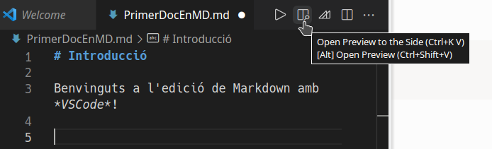

---
# Informació general del document
title: 2. Edició de fitxers amb Markdown
lang: ca
page-background: img/bg.png

# Portada
titlepage: true
titlepage-rule-height: 2
titlepage-rule-color: AA0000
titlepage-text-color: AA0000
titlepage-background: img/portada.png

# Taula de continguts
toc: true
toc-own-page: true
toc-title: Continguts

# Capçaleres i peus
header-left: 2. Edició de fitxers amb Markdown
header-right: Curs 2021-2022
footer-left: CEFIRE València
footer-right: \thepage/\pageref{LastPage}

# Imatges
float-placement-figure: H
caption-justification: centering

# Llistats de codi
listings-no-page-break: true
listings-disable-line-numbers: false

header-includes:
   - \usepackage{lastpage}
---

# Edició de fitxers Markdown

Markdown es un format de fitxer de text, pel que qualsevol editor de text senzill ens serà suficient.

No obstant això, existeixen diverses eines especialitzades en l'edició d'aquest tipus de fitxers, tant en entorns d'escriptori com web. Els que es mostren a continuació són alguns d'ells, però hi ha molts més:

* **Editors en línia**
    - Dillinger: [https://dillinger.io/](https://dillinger.io/)
    - Draft: [https://draftin.com/](https://draftin.com/)
    - Stackedit: [https://stackedit.io/](https://stackedit.io/)

* **Editors d'escriptori**
    - Typora: [https://typora.io/](https://typora.io/)
    - WriteMonkey: [https://writemonkey.com/](https://writemonkey.com/)
    - Haroopad: [http://pad.haroopress.com/](http://pad.haroopress.com/)

La majoria d'ells consisteixen en una finestra dividida on podem escriure en format Markdown a una part, i veure'n el resultat en directe al costat. El cas de Typora és un tant especial, ja que ens permeten escriure en Markdown i anar renderitzant automàticament el que fem, acostant-se al que sería un editor tipus WYSIWYG.

## Visual Studio Code

En aquest document, us presentarem l'editor Visual Studio Code (en avant VSCode), de Microsoft, que tot i tractar-se d'un editor per a l'edició del codi font de programes informàtics, suporta directament el llenguatge *Markdown*, i ofereix una previsualització del document. 

VSCode és un editor lleuger i multiplataforma, amb una interfície bastant neta, una extensa paleta d'ordres a les que podem accedir per dreceres de teclat, terminal integrada, suport al control de versions, etc. Però una de les coses més interessants, és que ens permet ampliar la seua funcoinalitat mitjançant extensions. Una d'aquestes extensions, la *Markdown All In One* aporta diferents utilitats per a Markdown, com ara tecles d'accés ràpid o suport a taules de continguts.

### Instal·lació de Visual Studio Code

L'opció d'instal·lació més senzilla és descarregar-lo directament des de la web [https://code.visualstudio.com/download](https://code.visualstudio.com/download) i instal·lar-lo mijançant el gestor de paquets que estiguem utilitzant (Discover, EPI, Gdebi, etc.).

Disposeu de més informació sobre el procés d'instal·lació tant en sisemes Linux com Windows a la web de l'editor:

* [https://code.visualstudio.com/docs/setup/linux](https://code.visualstudio.com/docs/setup/linux)
* [https://code.visualstudio.com/docs/setup/windows](https://code.visualstudio.com/docs/setup/windows)

### Presa de contacte amb VSCode

Una vegada instal·lat, tenim el Visual Studio Code accessible des del menú principal del sistema, dins de *Programació*.

La primera vegada que l'obrim ens demanarà si volem treballar amb un tema clar o fosc. Triarem un qualsevol d'ells.

La interfície general de VSCode presenta un aspecte semblant al següent:

{ width=450px }

On tenim els següents elements:

* La **barra d'activitats**, situada a l'esquerra, amb cinc activitats principals: L'**explorador de fitxers**, la de **Búsqueda de text**, la de **control de versions amb Git**, la de **depuració**, i la d'**extensions.** Cadascuna d'aquestes activitats, ens obrirà una altra barra lateral al costat amb les diferents possibilitats que ofereix l'activitat.
* La **finestra de benvinguda**, situada a la part principal de l'editor, que ocupa la part superior, i que ens ofereix algunes **opcions d'inici** com crear un fitxer nou, obrir una carpeta o afegir un espai de treball. A més, disposem també d'una secció de **fitxers recents**, inicialment buida, i de diversos **opcions de personalització**, com extensions per suportar alters llenguatges, dreceres de teclat, i temàtica de l'editor. En aquesta finestra, també disposem d'algunes opcions d'**Ajuda**, i alguns *tips* per aprendre, com la llista d'ordres o una ullada a la interfície.
* Diversos **panells**, situats al davall de la finestra principal de l'editor, i que mostraran informació sobre la depuració, errors, avisos, o bé la terminal integrada a VSCode.
* A la part inferior, distingim finalment la barra d'estat, amb informació sobre el projecte i els fitxers oberts.

A les últimes versions, quan obrim una carpeta nova, també ens demana que confirmem si *confiem* en qui ha fet el codi que hi ha en aquesta carpeta:

{ width=450px }

Disposeu de més informació sobre la interfície de VSCode en:

* [https://code.visualstudio.com/docs/getstarted/userinterface](https://code.visualstudio.com/docs/getstarted/userinterface)

### Treballant amb VSCode i Markdown

Amb VSCode podem editar fitxer directament, però el més interessant, és que podem obrir una carpeta i treballar directament sobre els fitxers que hi conté i explorar-los amb l'activitat de l'explorador de fitxers integrat.

Per a això, només hem de fer clic al botó *Open Folder* ubicat a l'activitat de l'explorador de fitxers:

{ width=5cm }

Què ens demanarà que seleccionem una carpeta per obrir. Al nostre cas, hem triat una carpeta anomenada *DocumentsMarkdown*.

Una vegada obrim la carpeta, se'ns mostrarà a l'activitat de l'explorador de fitxers l'estuctura d'arbre corresponent a la carpeta, amb tots els fitxers i carpetes que conté. Al nostre cas, aquest carpeta conté dos carpetes més: *Unitat 1* i *Unitat 2*:

{ width=5cm }

Si ens fixem, al costat del nom de la carpeta principal apareixen quatre icones, amb el següent significat:

* El primer, per crear un nou document, en la carpeta o subcarpeta que tinguem seleccionada.
* El segon per crear una carpeta nova, en la carpeta o subcarpeta que tinguem seleccionada.
* El tercer per refrescar la vista, per si hem afegit fitxers a través d'altres aplicacions a la carpeta, i
* El quart serveix per comprimir l'estructura d'arbre, deixant només els elements que estan al primer nivell en la carpeta principal.

Si el que volem ara és crear un nou document, farem click al primer d'aquests botons, de manera que ens demanarà el nom del fitxer per afegir-lo a la carpeta en què estiguem.

>
> **Important** 
> 
> L'extensió d'un fitxer de text en format Markdown és `.md`. Tot i que es tracta d'un fitxer de text, pel que podría ser `.txt` o qualsevol altre, convé utilitzar aquesta extensió perquè les aplicacions el reconeguen com a tal.
>
> En VSCode, si es fixeu, apareixerà una icona amb una fletxa cap avall, indicant que es tracta d'un fitxer Markdown.
>

{ width=5cm }

Una vegada creat, podem començar a escriure directament al fitxer. 

A la part superior dreta de la finestra de l'editor, veureu que apareixen diverses icones. Aquestes poden variar segons les extensions que tingam instal·lades al nostre equip. 

Una d'aquestes icones és un rectangle dividit amb una lupa. Aquesta icona és la que ens permetrà activar la vista dividida, i veure a la part esquerra de la finestra el text que escrivim, i a la dreta una previsualització d'aquest.

{ width=6cm }

{ width=15cm }

Per tancar aquesta vista prèvia, només cal que fem click al símbol de la creu (`x`) que apareix al costat del nom del fitxer en la previsualització.

### Instal·lació de plugins en VSCode

VSCode és un editor lleuger, i alhora extremadament flexible mitjançant plugins o extensions.
 
Per afegir extensions, fem clic a l'**activitat d'extensions**, ubicada cap a la part inferior de la barra d'activitats. En ella tenim disponible un quadre de cerca, al que podem buscar qualsevol cosa. Si escrivim *Markdown*, veurem totes les extensions existens relacionades amb aquest:

{ width=17cm }

Com hem vist, en principi, no necessitem cap extensió per treballar directament amb Markdown en VSCode i fer-ne una previsualització. No obstant això, extensions com la comentada *Markdown All In One* ens aporta diferents utilitats interessants. A mesura que avancem el curs, veurem algunes d'aquestes extensions d'interès.

Si volem instal·lar l'extensió, només caldrà que fem clic al botó *Install* que apareix al costat de l'extensió o en la descripció d'aquesta. 
