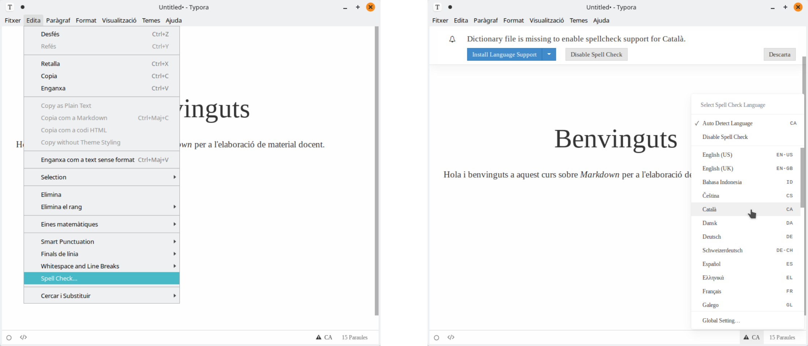
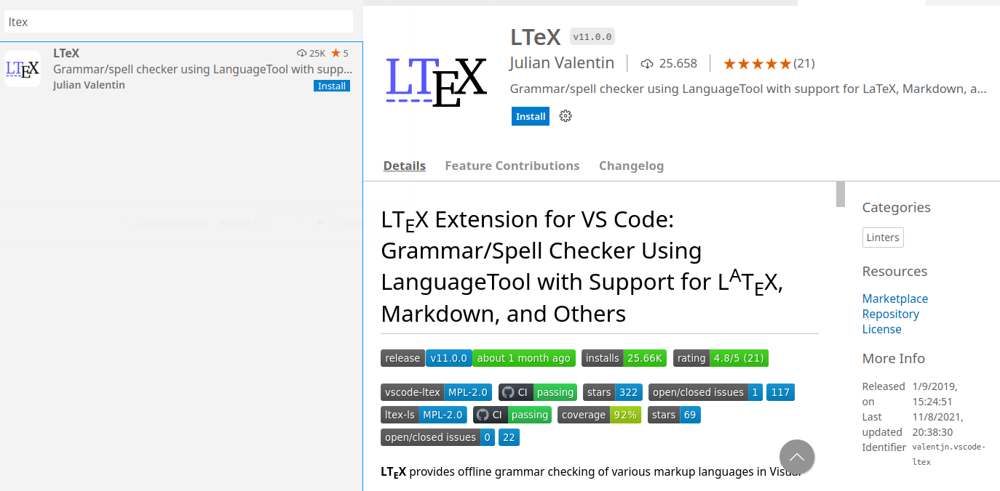
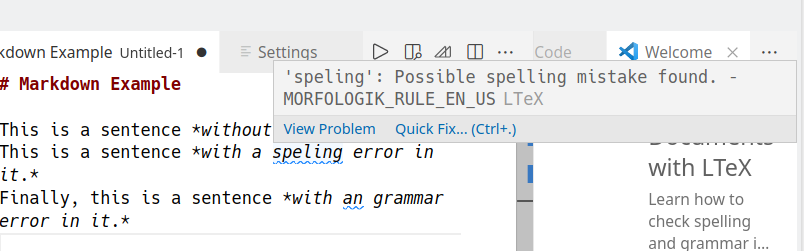
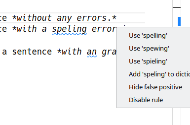
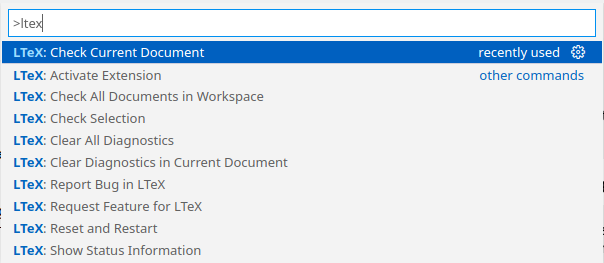

---
# Informació general del document
title: 3. Correcció ortogràfica
lang: ca
page-background: img/bg.png

# Portada
titlepage: true
titlepage-rule-height: 2
titlepage-rule-color: AA0000
titlepage-text-color: AA0000
titlepage-background: img/portada.png

# Taula de continguts
toc: true
toc-own-page: true
toc-title: Continguts

# Capçaleres i peus
header-left: 1. El llenguatge Markdown
header-right: Curs 2021-2022
footer-left: CEFIRE València
footer-right: \thepage/\pageref{LastPage}

# Imatges
float-placement-figure: H
caption-justification: centering

# Llistats de codi
listings-no-page-break: true
listings-disable-line-numbers: false

header-includes:
   - \usepackage{lastpage}
---

# Correctors ortogràfics i Markdown

Un dels principals avantatges dels processadors de textos és que incorporen un corrector, que detecta errors ortogràfics mentre escrivim.

Els editors, per norma general, no solen oferir aquesta possibilitat, per la qual cosa, quan editem textos en format Markdown mitjançant un editor de text, si no posem remei, hauríem d'anar molt amb compte de no cometre errors ortogràfics. No obstant això, tot i que no sol ser tan trivial com en un processador de textos, aquesta correcció en un editor de text sí que sol ser possible.

En aquest document, anem a veure com podríem realitzar la correcció ortogràfica en dues eines per treballar amb Markdown: Typora y Visual Studio Code.

## Correcció en Typora

L'eina Typora, ja vam comentar que era una eina bastant senzilla alhora que potent, ja que ens permet l'escriptura amb Markdown mentre converteix el que escrivim directament al format final en el mateix document. 

Si volem activar la correcció automàtica en Typora, només caldrà que busquem l'opció *Spell Check...* al menú d'edició. En aquest moment, se'ns donarà l'opció d'escollir l'idioma. També podríem haver arribat ací, amb el botó de configuració de l'idioma, ubicat a la part inferior dreta de la finestra.

{ width=15cm }

La primera vegada que l'activem, ens demanarà descarregar el diccionari. Una vegada fet, podem apreciar com els textos ja apareixen corregits.

{ width=15cm }

## Correcció amb Visual Studio Code

Tot i que l'editor VS Code està pensat per a la programació, ofereix també la possibilitat de realitzar correccions de textos mitjançant extensions.

L'extensió amb la què treballarem s'anomena *LTeX*, que fa ús del servei de traducció en línia [*LanguageTool*](https://languagetool.org/). 


### L'extensió LTeX

L'extensió LTeX proporciona correcció gramatical per a diversos llenguatges de marcat en Visual Studio Code, fent ús, d'un corrector extern com és l'eina *LanguageTool*. A més de Markdown, admet altres tipus de documents de marcat. 

>
> **LanguageTool**
>
> LanguageTool és un assistent d'escriptura intel·ligent pensat per a navegadors web i processadors de text, que ofereix una API (Application Programming Interface) a través de la qual, altres aplicacions poden utilitzar el servei a través d'Internet.
>

Aquesta extensió, a més de la correcció ortogràfica, també corregeix errors gramaticals i estilístics. Per tal de realitzar-ne la instal·lació, només haurem d'anar a l'activitat de VSCode d'*extensions*, i buscar l'extensió LTeX:

{ width=15cm }

Una vegada localitzada, només haurem de fer clic en el botó *Instal·la* per començar a utilitzar-la.

D'aquesta manera, quan anem escrivint, tot i que és possible que siga un procés lent, sobretot si els textos són llargs, l'editor anirà realitzant la correcció ortogràfica. En el moment en què trobe una errada, ens la marcarà amb un subratllat. 

Si situem el cursor del ratolí a sobre l'error, ens apareixerà un xicotet diàleg emergent amb la descripció de l'error, i dos opcions: *View Problem*, per consultar detalls de l'errada, i *Quick Fix*, per veure les possibles solucions a l'error:

{ width=15cm }

Si fem clic en aquesta segona, ens mostrarà diversos suggeriments per realitzar la correcció, així com afegir la paraula al diccionari, amagar un *fals positiu* o bé desactivar la regla. Naturalment, també podrem realitzar la correcció de forma manual:

{ width=10cm }

#### Sobre la freqüència de comprovació i les correccions manuals

Quan corregim automàticament una errada ortogràfica, l'extensió LTeX és conscient que aquesta ja està corregida i elimina directament el subratllat.

Aquesta extensió, per tal de no ralentir l'editor, no realitza contínuament correccions, sino que ho fa cada cert temps (aquesta freqüència es pot modificar a través del paràmetre `LTeX: Check Frequency`, encara que tampoc és recomanable, per no sobrecarregar l'editor)

Cal tindre açò en compte, especialment quan fem correccions de forma manual, ja que l'eliminació del subratllat no és instantània. A més, és bastant freqüent que les modificacions que fem a mà facen que alguns subratllats es *desplacen* fins que es torne a invocar el corrector de nou.

Per altra banda, si desitgem invocar el corrector en un moment donat, podem fer-ho a través de la *Paleta d'ordres*, accessible mitjançant la combinació de teclat `Ctrl`+`Majúscules`+`P` i buscant l'ordre LTeX: *Check current Document*.

{ width=10cm }


#### Limitacions amb LanguageTool

Com hem comentat, l'extensió LTeX utilitza un servidor extern com és [*LanguageTool*](https://languagetool.org/).

Aquest servei s'ofereix [de forma pública a través d'una API]((https://dev.languagetool.org/public-http-api)) a través de la qual, altres aplicacions poden utilitzar-la a través d'Internet. El problema és que aquest servidor públic aplica certes restriccions relatives a la quantitat de peticions que es poden realitzar en un temps donat.

L'alternativa per la qual podem optar, per tal de no estar subjectes a aquestes restriccions, és oferir al nostre ordinador el mateix servei, tal com veurem al següent apartat.

### El servei LanguageTool

El servidor de LanguageTool es distribueix sota una llicència lliure, de manera que podem descarregar-lo i executar-lo al nostre ordinador.

A més, aquest es distribueix ja empaquetat com a una aplicació Java, de manera que, en línies generals, només haurem de descarregar el paquet, descomprimir-lo i executar-lo amb Java.

Per a això, seguirem els següents passos:

1. En primer lloc, descarreguem el paquet [LanguageTool-stable.zip](https://languagetool.org/download/LanguageTool-stable.zip) des de la web del languageTool.
2. Descomprimim el fitxer descarregat en la nostra carpeta d'usuari, per exemple, el que ens crearà la carpeta *LanguageTool-5.4*.

Si ho fem a través de la línia d'ordre faríem el següent. Ens situaríem a la nostra carpeta d'usuari i descarregaríem directament el fitxer comprimit amb:


    ```bash
    $ wget https://languagetool.org/download/LanguageTool-stable.zip
    ...
    ```

    I ara el descomprimiríem a la mateixa carpeta amb:

    ```
    $ unzip LanguageTool-stable.zip
    ...
    ```

1. Ara, per tal d'executar el servidor de LanguageTool, necessitarem l'entorn d'execució de Java (JRE). Si el tenim instal·lat al nostre equip, només caldrà situar-nos dins la carpeta del *LanguageTool-5.4*:

    ```
    $ cd LanguageTool-5.4
    ```

2. I llançar-lo amb la següent ordre:

    ```
    java -cp languagetool-server.jar org.languagetool.server.HTTPServer --port 8081 --allow-origin "*"
    ```

    Amb açò el que fem és que el servidor estiga disponible al nostre ordinador a través del port 8081, i permeta qualsevol connexió.

    Tingueu en compte que veurem una eixida per la terminal semblant a la següent:

    ```bash
    2021-09-11 09:23:02.420 +0200 INFO  org.languagetool.server.DatabaseAccess Not setting up database access, dbDriver is not configured
    2021-09-11 07:23:02 +0000 WARNING: running in HTTP mode, consider running LanguageTool behind a reverse proxy that takes care of encryption (HTTPS)
    2021-09-11 07:23:03 +0000 Setting up thread pool with 10 threads
    2021-09-11 07:23:03 +0000 Starting LanguageTool 5.4 (build date: 2021-06-25 10:24:16 +0000, ba046d4) server on http://localhost:8081...
    **2021-09-11 07:23:03 +0000 Server started**
    ```

    **Aneu amb compte i no tanqueu aquesta finestra, ja que quan ho feu, aturareu el servidor.**

>
> **Si no tenim el JRE...**
>
> El JRE (Java Runrime Environment), o entorn d'execució de Java, que ofereix junt amb certes llibreríes del sistema, la màquina virtual de Java, que és la que s'encarrega d'executar aquest tipus d'aplicacions.
>
> LliureX ja disposa del JRE preinstal·lat pe omissió. En cas que no el tinguem instal·lat al nostre equip (no es troba l'ordre `java`), podem instal·lar el paquet `default-jre`, des de qualsevol gestor de programari.
>
> Per exemple, per a fer-ho des de la terminal directament escriuríem:
>
> ```...
> $ sudo apt update
> ...
> $ sudo apt install default-jre
> ```

#### Configurant LTeX per al servidor local

Ara només ens quedarà indicar-li a l'extensió d'LTeX que volem fer ús del nostre servidor local, en lloc del servidor d'Internet per defecte.

Això ho aconseguim modificant alguns paràmetres de la configuració d'aquesta extensió. 

Per tal d'obrir la finestra de configuració de VSCode, ho farem a través del menú *File > Preferences > Settings*, o bé directament prement la combinació de tecles `Ctrl`+`,` (tecles *Control* i *coma*). 

{ width=10cm }

Açò ens mostrarà tots els paràmetres de configuració. Podem buscar el que desitgem a la barra de cerca que apareix a la part superior. Així doncs, ens situem en aquesta i comencem a buscar `ltex.ltex-ls`, ja ens apareix la primera opció el paràmetre *Ltex › Ltex-ls: Language Tool Http Server Uri*, que en principi no tindrà valor.

El que farem serà configurar el valor d'aquest paràmetre com a: 

```
http://localhost:8081
```

{ width=15cm }

Que és com s'ha configurat el nostre servidor. D'aquesta manera, ja utilitzarem aquest en lloc del servei a Internet.

#### Selecció de l'idioma

Una altra opció que ens serà d'utilitat, és la de canviar l'idioma, que farem a través de la modificació del paràmetre `ltex.language`:

{ width=15cm }

Amb això serà suficient, i no serà necessari instal·lar cap extensió específica per a l'idioma.
