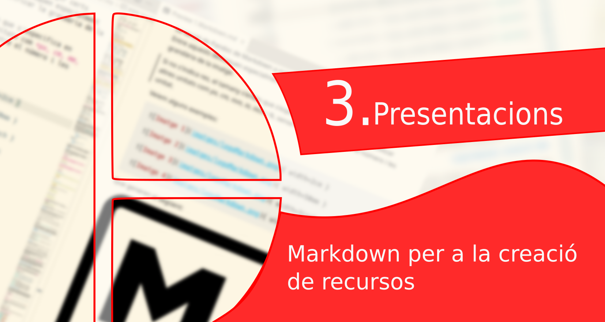
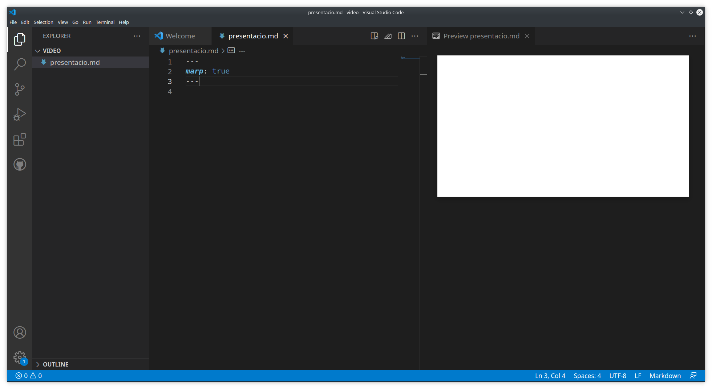
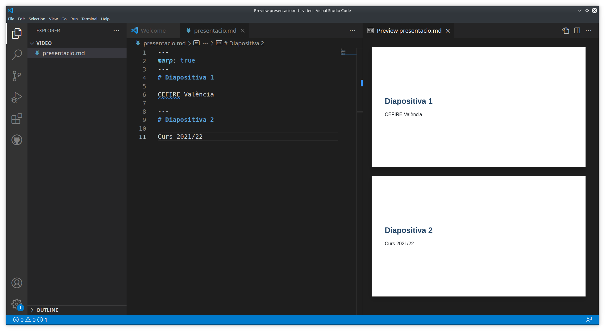
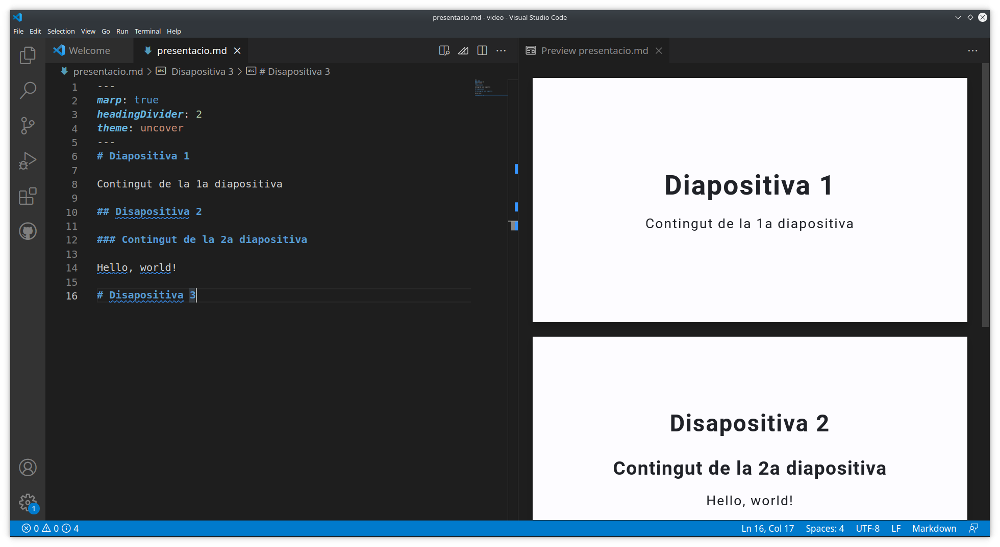
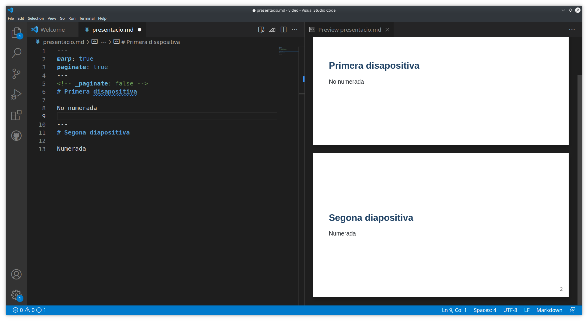
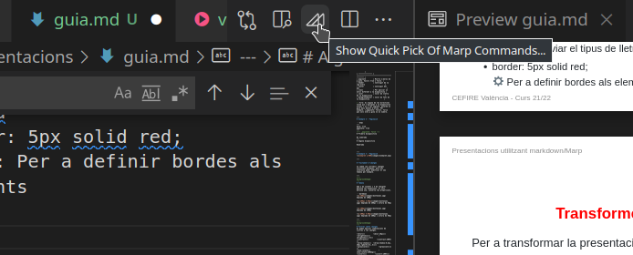
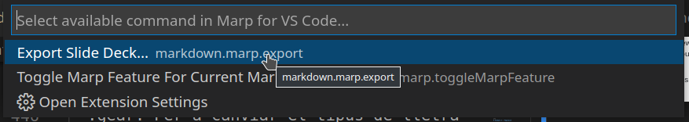
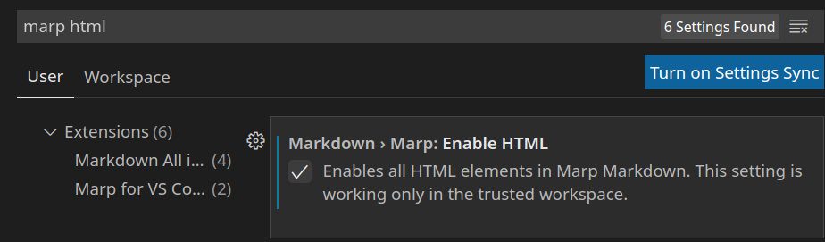

<!--
_header: ''
_footer: ''
-->


---
# Presentacions
Una vegada ja sabem utilitzar el llenguatge markdown i crear documents. **Perquè no crear presentacions també** utilitzant este llenguatge?

Existeixen diferents ferramentes que ens poden ajudar en aquesta tasca, algunes d'elles les podeu veure al següent [enllaç.](https://gist.github.com/johnloy/27dd124ad40e210e91c70dd1c24ac8c8)

Nosaltres ens centrarem en [**Marp**](https://marp.app/).

---
# :book: Què és Marp?

És un conjunt de ferramentes per a crear presentacions que transforma documents **markdown + CSS** en presentacions **HTML + CSS, PDF, PPTX, ...**

> :fire: 
> CSS (Cascading Style Sheets) és el llenguatge utilitzat a les pàgines web per definir el seu estil, és a dir, com es veuran (colors, formes, màrgens, ...). Ho veurem amb més detall més endavant.


---
# Marp vs altres

Encara que Marp és una ferramenta que **no permet grans efectes visuals**, com altres de les que podeu trobar a l'[enllaç anterior](https://gist.github.com/johnloy/27dd124ad40e210e91c70dd1c24ac8c8) i que podeu provar, pots crear amb ella presentacions d'aspecte professional d'una forma molt més simple, per tant és la que recomanem. Una mostra del que es pot fer amb Marp, és el document que esteu vegent en estos moments.

Altres alternatives com [reveal.js](https://revealjs.com/) són més complexes d'utilitzar, i sols les recomanem si sou desenvolupadors o esteu familiaritzats amb el desenvolupament web.

[Deckset](https://www.deckset.com/) és una altra opció, però és de pagament.

---
# :gear: Com utilitzar Marp

Abans de començar a utilitzar Marp, caldria configurar l'entorn per a utilitzar-lo de forma més còmoda. De nou utilitzarem el *Visual Studio Code* per a crear les nostres presentacions.

L'única cosa que heu d'instal·lar és l'extensió ***Marp for VS Code*** dels desenvolupadors *Marp Team*.

> :fire:
> Si no recordeu com s'instal·la una extensió al VS Code, ho teniu explicat al pdf *ConfigurarVSCodePandoc.pdf* de l'anterior tema.

---
# Començant amb Marp
El primer que hauriem de fer és crear un document markdown. Al front matter (capçalera YAML) definirem que volem habilitar l'extensió marp per poder previsualitzar la presentació. Si previsualitzem el resultat, obtindrem una imatge com la següent.

```markdown
---
marp: true
---
```


---
# Començant amb Marp
Per canviar de diapositiva, insertarem un salt de línia i tres guionets.

> També es pot utilitzar ___, *** o - - - (sense línia obligatòriament)


El contingut de les diapositives l'escrivim directament amb markdown.

---
# Exemple 1

```markdown
---
marp: true
---
# Diapositiva 1

CEFIRE València

---
# Diapositiva 2

Curs 2021/22

```
---
# Exemple 1



---
# Ús de directives

Amb directives podem controlar el tema, la numeració de pàgines, l'encapçalament, el peu de pàgina, l'estil, etc.

---

Hi ha dos formes d'ús de directives:

1. Sintaxi de *YAML* al front matter:
   
```markdown
---
theme: default
paginate: true
---
```

2. Sintaxi de comentari d'html, que es pot utilitzar dins les diapositives o al front matter:

```html
<!--
theme: default
paginate: true
-->
```


---
# Directives
S'apliquen a **tot el document** i sols s'aplica la última opció en cas d'estar definida en diversos llocs.

| Nom            | Descripció                                                                                               |
| -------------- | -------------------------------------------------------------------------------------------------------- |
| theme          | Especifica el tema per a tota la presentació. Els temes definits són **default**, **gaia** i **uncover** |
| style          | Especifica l'estil per a tota la presentació. S'han d'afegir les regles CSS que considerem               |
| headingDivider | Opció per a dividr les diapositives a través del nivell dels títols                                      |
| size           | Especifica el tamny de la diapositiva 16:9 o 4:3                                                         |

---
# Exemple 2

```markdown
<!-- headingDivider: 2 -->

# Diapositiva 1

Contingut de la 1a diapositiva

## Disapositiva 2

### Contingut de la 3a diapositiva

Hello, world!

# Disapositiva 3
```

---
# Exemple 2



---
# Directives locals

S’aplicaran a la pàgina on la definim i a les pàgines següents.

<style scope> table{ font-size: 16px; }</style>

| Nom             | Descripció                                     |
| --------------- | ---------------------------------------------- |
| paginate        | Mostra números de pàgina. Valors true o false. |
| header          | Contingut de la capçalera                      |
| footer          | Contingut del peu                              |
| class           | Per aplicar un estil diferent a la diapositiva |
| color           | Color de lletra de la diapositiva              |
| backgroundColor | Color de fons de la diapositiva                |

> :fire: Si alguna de les directives volem que s'apliquen a la diapositiva actual i no a les següent, posarem un guió baix davant d'elles. Per exemple, *_paginate: false*, faria que sols esta pàgina no es numere.


---
# Exemple 3 - Paginació

```html
---
marp: true
paginate: true
---
<!-- _paginate: false -->
# Primera disapositiva

No numerada
---
# Segona diapositiva

Numerada

```

---
# Exemple 3 - Paginació


---
# Insertar emojis
La inserció d'emojis no és una característica exclusiva de les presentacions però encara no s'havia comentat. 

Podeu fer ús de marques per a insertar emojis. Al següent enllaç teniu una llista quasi completa.

[Llista d'emojis amb les seues marques](https://gist.github.com/rxaviers/7360908)

Per exemple, per a insertar un emoji d'una cara somrient, utilitzarem `:smile:`.

:smile:

---

# Tractament d'imatges

Ja sabem com introduir imatges utilitzant markdown, però ens interessa poder modificar el seu tamany per exemple.

---
<!--
backgroundImage: 
-->
# Tamany

Amb w de *width* i h de *heigth* definim les dimensions. Si sols definim una, conserva les proporcions.

```markdown
 Amplada de 100px

 Amplada de 200px i altura de 50px
```

 Amplada de 100px

 Amplada de 200px i altura de 50px

---
<!--
backgroundImage: 
-->
# Filtres sobre imatges
Es poden aplicar combinacions de filtres a les imatges.
```
	        
	        
	        
	
	        
	        
	        
	        
	        
	        
```
---
<!--
backgroundImage: 
-->
>:fire: Podem aplicar diversos filtres a la vegada


```

```
---
# Imatges com a imatge de fons - *background*

També podem definir imatges com a imatge de fons de diapositives utilitzant l'etiqueta **bg**.

```markdown

```


---
<!--
backgroundImage: 
-->
# Tamany de background
| Modificador | Descripció                                                |
| ----------- | --------------------------------------------------------- |
| cover       | Escala la imatge per omplir la diapositiva. (Per defecte) |
| contain     | Escala la imatge per ajustar a la diapositiva.            |
| auto        | No escala, tamany original                                |
| x%          | Escala al percentatge indicat                             |

---
<!--
backgroundImage: 
-->
```markdown

```


---
<!--
backgroundImage: 
-->

```markdown

```


---
<style scope>
  h1 {
    text-align: center;
    font-size: 130%;
  }
</style>
# Backgrounds múltiples
```


```


---

# Backgrounds múltiples
Podem combinar diverses imatges de fons, tant de forma vertical com horitzontal.
```


```


---

# Partir l'espai


```

```

El contingut de la diapositiva es situa a l'esquerra. Inclús el *header* i el *footer*.

---
# Partir l'espai
```markdown


```


---
# Partir l'espai
```markdown

```


---
<!--
backgroundImage: url('images/prova2.png')
-->
# Aplicant estils a les diapositives

>:fire: Si no esteu familiaritzats amb l'ús d'estils, este apartat vos pot resultar complicat. No us assusteu, es poden deixar els estils per defecte dels diferents temes.

Per a aplicar estils customitzats i diferents als definits en els estils del tema per defecte hem d'utilitzar CSS.
> CSS és l'estàndar utilitzat a la web per a configurar l'aparença de les pàgines.


---
<style scoped> h1{ color: green; }</style>
# Regles CSS
CSS està basat en regles de la forma:
```
element {atribut: valor}
```
Quan definim una regla, s'aplicarà a totes les diapositives a partir d'eixa.

Hem d'utilitzar *scoped*, per a aplicar una regla sols a la diapositiva actual i no sobreescriure la directiva global. Per exemple:
```css
<style scoped> h1{ color: green; }</style>
```


---

<style scoped>
  table{
    font-size: 65%;
  }
</style>

# Elements importants CSS per a les nostres diapositives

| Element    | Descripció                       |
| ---------- | -------------------------------- |
| section    | Dispositiva                      |
| h1 ... h6  | Encapçalaments                   |
| p          | paràgraf                         |
| table      | taules                           |
| ol         | Elements de llistes numerades    |
| ul         | Elements de llistes no numerades |
| img        | Imatges                          |
| img.emoji  | Emojis                           |
| code       | Markdown marcat amb ```          |
| blockquote | Markdown marcat amb >            |

---
<style scoped>
  ul{
    font-size: 25px
  }
</style>
# Alguns atributs CSS importants

Els principals atributs que utilitzareu, seran:

* font-size: 20px 
  :gear: Per a canviar el tamany de lletra
* color: red
   :gear: Per a canviar el color de la lletra.
* text-align: center | left | right | justify
  :gear: Per a aliniar el text a dreta, esquerra o centre.
* background-color: red
  :gear:Per a definir el color de fons sense utilitzar la directiva.
* font-family: "Times New Roman", Times, serif;
  :gear: Per a canviar el tipus de lletra
* border: 5px solid red;
  :gear: Per a definir bordes als elements


---
# Transformem el .md a html, pdf, pptx, ...

Per a transformar la presentació en .md a altres formats, utilitzarem l'extensió de marp que haviem instal·lat. Simplement fem clic al logo de marp, just al costat de l'icona de previsualització.


Ens apareixerà l'opció d'exportar, sobre la que fem clic.


Finalment seleccionem el format que volem i el nom d'arxiu a la finestra de l'explorador.

---
# Exportació a html
Si exporteu a html, veureu que vos crea un arxiu html de presentació per a ser visualitzat amb el navegador, on podem anar passant les diapositives amb les fletxes del teclat, amb el ratolí, veure'l a pantalla completa, etc 

Si treballeu d'esta manera (altament recomanat), recordeu que la carpeta des d'on hem carregat les imatges o altres recursos han d'estar en la mateixa ruta des de la qual es van insertar perquè es carreguen de forma correcta, igual que feiem en markdown.

---
# Marp-cli
Si eres dels que preferix la consola, pots instal·lar l'aplicació de consola marp i utilitzar-la. S'ha d'instal·lar primer el *nodejs* (versió 12 almenys), després el seu gestor de paquest *npm* i per últim instal·lem *marp*. 

> :fire: Instal·leu el *chromium-browser* sols en cas de no tindre el *Google-Chrome* instal·lat.

~~~bash
$ curl -sL https://deb.nodesource.com/setup_14.x | sudo bash - 
$ sudo apt install nodejs
$ sudo apt install npm
$ sudo npm install -g @marp-team/marp-cli
$ sudo apt install chromium-browser 
~~~

---
# Ús de marp-cli
```bash
$ marp -h # Per veure les opcions
$ marp <arxiu.md> # Per a convertir a pàgina web
$ marp --pptx <arxiu.md> # Per a convertir a pptx
$ marp --pdf --allow-local-files <arxiu.md> # Per a passar a pdf
      # amb --allow-local-files permetem que accedisca a imatges locals
      # si les imatges estan a internet, no cal
```

---
<style scoped>
  p {
    font-size: 80%
  }
</style>
# Baixem la mida dels pdf
Els pdf ocupen molt perquè realment cada diapositiva és una imatge. Els podem reduir amb ghostscript. 
> També els podem intentar baixar la qualitat exportant-los o imprimint a un arxiu pdf amb menor qualitat. Estes opcions les tindreu en el lector de pdfs, però depén dels sistemes que utilitzeu.
```bash
$ gs -sDEVICE=pdfwrite -dCompatibilityLevel=1.4 -dPDFSETTINGS=/ebook -dNOPAUSE -dQUIET
        -dBATCH -sOutputFile=pdf_reducido.pdf pdf_original.pdf 
```
On -dPDFSETTINGS pot agafar els següents valors. Per a presentacions sobra amb qualitat screen.

dPDFSETTINGS=/**screen** (72 dpi, qualitat baixa)
dPDFSETTINGS=/**ebook** (150 dpi, qualitat mitja)
dPDFSETTINGS=/**printer** (300 dpi, alta qualitat)
dPDFSETTINGS=/**prepress** (300 dpi, alta qualitat preservant el color)
dPDFSETTINGS=/**default** (quasi idèntic a screen, però amb qualitat lleugerament superior)

---
# Comparació de quantitat de disc ocupat
Exemple:
```bash
$ gs -sDEVICE=pdfwrite -dCompatibilityLevel=1.4 -dPDFSETTINGS=/screen -dNOPAUSE -dQUIET 
  -dBATCH -sOutputFile=marpit_red.pdf marpit.pdf
$ ls -lh | grep pdf
-rw-rw-r-- 1 ferran ferran  50M Feb 26 16:58 marpit.pdf
-rw-rw-r-- 1 ferran ferran 757K Feb 26 16:48 marpit_red.pdf
```
Hem aconseguit baixar de 58 MB a 757KB transformant-lo a qualitat screen.

---
# Ampliació - Habilitem HTML

Per a poder insertar arxius multimèdia, el primer pas és habilitar l'inserció de codi html en les presentacions. Per això anem a:  
File -> Preferences -> Settings del VS Code

Busquem marp i html (a la vegada) i habilitem l'html.



Ara podem insertar, a banda de markdown, codi html.

---
# Insertem un vídeo local
Si tenim una carpeta images que conté un arxiu *video.mp4*, l'insertem de la següent forma.
```html
<video width="600" height="400" controls>
  <source src="video/planeta.mp4">
El teu navegador no soporta l'etiqueta video. Actualitza'l.
</video>
```
<video width="600" height="400" controls>
  <source src="video/planeta.mp4" type="video/mp4">
El teu navegador no soporta l'etiqueta video. Actualitza'l.
</video>

---
# Insertem un video de youtube
La majoria de plataformes de video, ja et donen el codi html per poder-lo insertar-lo a la teua web o al teu curs d'aules. L'utilitzem d'igual forma a la nostra presentació. 

Per exemple, per a insertar el curt *Pipas* des de youtube, el busquem a la web de youtube i fem clic al botó *Comparteix*. Després seleccionem *<>Insereix* i copiem el codi que ens proporciona a la presentació.

```html
<iframe width="560" height="315" 
  src="https://www.youtube.com/embed/H1v-bCyeIR4" 
  title="YouTube video player" frameborder="0" 
  allow="accelerometer; autoplay; clipboard-write; encrypted-media; gyroscope; picture-in-picture" 
  allowfullscreen>
</iframe>
```

---
# Curtmetratge *Pipas*
<iframe width="560" height="315" 
  src="https://www.youtube.com/embed/H1v-bCyeIR4" 
  title="YouTube video player" frameborder="0" 
  allow="accelerometer; autoplay; clipboard-write; encrypted-media; gyroscope; picture-in-picture" 
  allowfullscreen>
</iframe>

---
# Insertem un clip d'àudio
Per a insertar un clip d'àudio utilitzarem l'etiqueta html audio. 

Si l'enllacem a un clip d'àudio local li posarem la ruta relativa a l'atribut *src*.

Si l'enllacem des d'internet, haurem de canviar el valor de l'atribut *src* per a que apunte a la seua url. 

Exemple si tenim un clip *forrest.mp3* a la carpeta audio.

```html
<audio controls>
  <source src="audio/forrest.mp3" type="audio/mpeg">
Your browser does not support the audio element.
</audio>
```
<audio controls>
  <source src="audio/forrest.mp3" type="audio/mpeg">
Your browser does not support the audio element.
</audio>

---
# Altre material multimèdia
Al tindre activa l'opció d'html, ara podem insertar qualsevol cosa que es puga insertar a una pàgina web, vídeo, àudio, adreça de google maps, aplicacions web, ...

Una altra forma d'insertar elements multimèdia d'internet és afegir el seu enllaç de forma que al fer clic s'obriga en un navegador web o en una pestanya nova del navegador. 